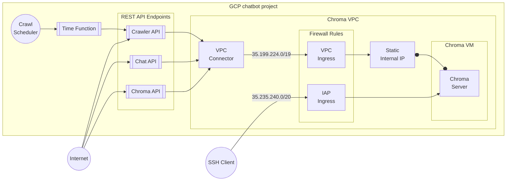

```mermaid
flowchart LR
  subgraph "GCP chatbot project"
    crawlerCF[[Crawler API]]
    chatCF[[Chat API]]
    chromaCF[[Chroma API]]
    crawlScheduler((Crawl\nScheduler))
    timeCF[[Time Function]]
    subgraph "Chroma VPC"
      subgraph "Firewall Rules"
        vpcFirewall[VPC\nIngress]
        iapFirewall[IAP\nIngress]
      end
      vpcConnector[VPC\nConnector]
      subgraph "Chroma VM"
        chromaServer[Chroma\nServer]
      end
      staticInternalIP[Static\nInternal IP]
      staticInternalIP o--o chromaServer
      vpcFirewall --> staticInternalIP
    end
    subgraph "REST API Endpoints"
      crawlerCF --> vpcConnector
      chatCF --> vpcConnector
      chromaCF --> vpcConnector
      vpcConnector --35.199.224.0/19--> vpcFirewall
    end
    crawlScheduler --> timeCF
    timeCF --> crawlerCF 
  end
  internet((Internet))
  internet --> crawlerCF
  internet --> chatCF
  internet --> chromaCF
  sshClient((SSH Client))
  sshClient --35.235.240.0/20--> iapFirewall
  iapFirewall --> chromaServer

```